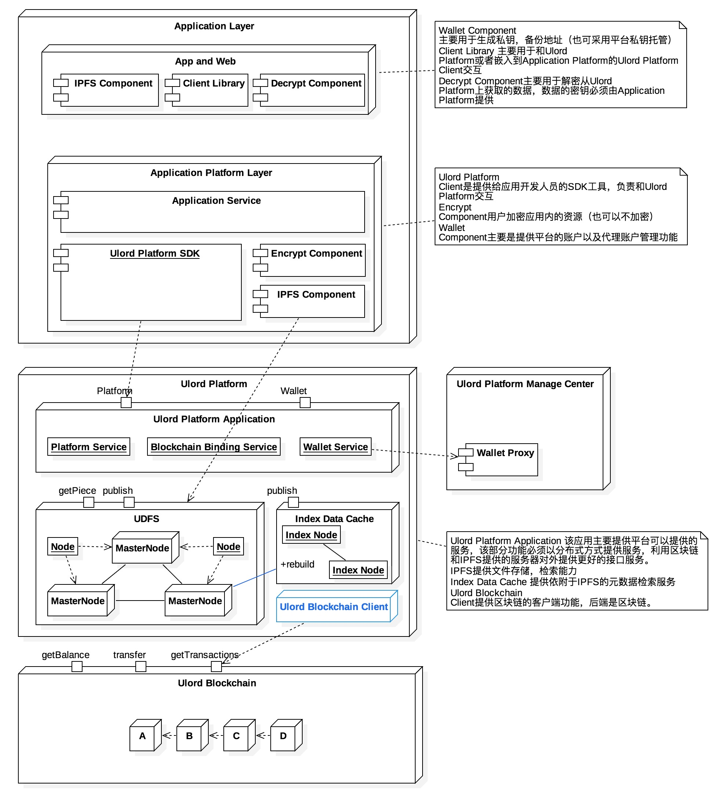
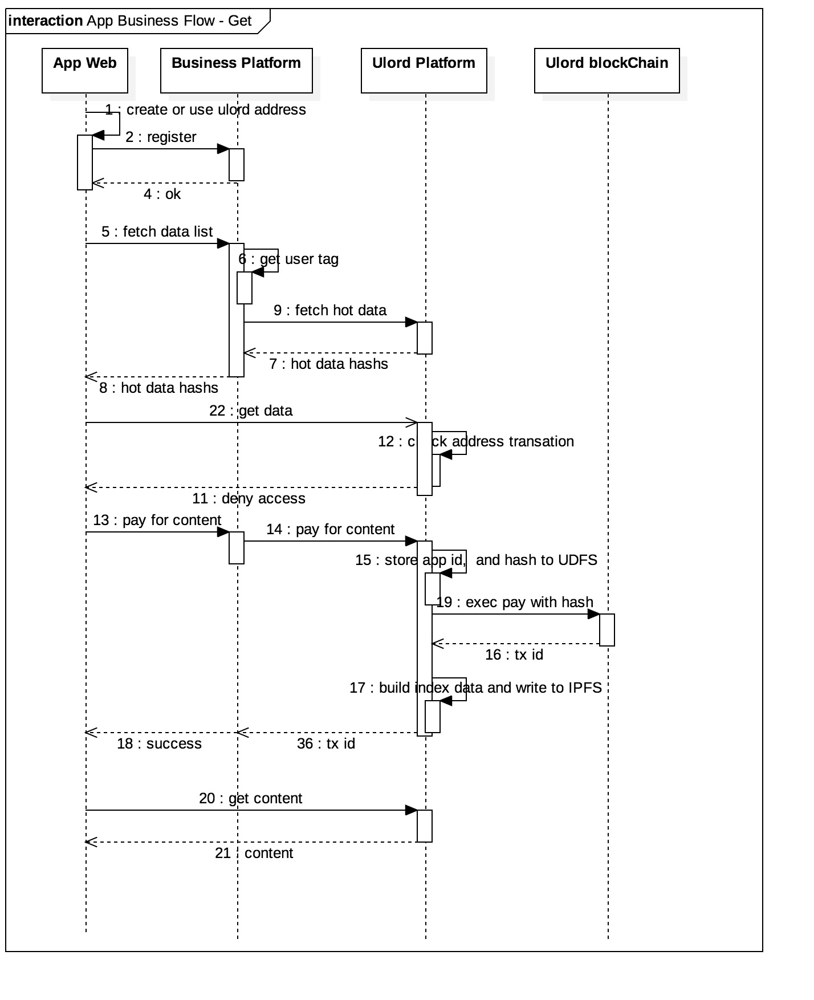

# Ulord Platform - The Most Powerfull Infrastructure for Content Distribution Applications
[中文](./README_zh.md)

Welcome to the Ulord Platform source code repository! Ulord platform software enables developers to create and deploy high-performance, horizontally scalable, blockchain infrastructure upon which content distribution applications can be built.

This code is currently alpha-quality and under rapid development. 

Ulord platform is decenterlize content distribution platform which can supply content repo, distribution and search ability. Ulord platform make enterprise development content distribution more effective.
Ulord platform have:
- decenterlize content storage service
- content transaction service
- content search service
- content copyright detected service
Ulord platform guarantee:
- Content is belong to enterprise
- Content copyright and audit is belong to enterprise 

## Resources
1. [Ulord Website](http://ulord.one)
2. [Documentation](https://github.com/UlordChain/documentation)
3. [Vocabulary](./vocabulary.md)

## Ulord platform architecture
Ulord platform combine ulord blockchain and open-source technology to implement content storage, distribution and search.

User get content from Ulord platform

User publish content to Ulord platform or Enterprise platform

