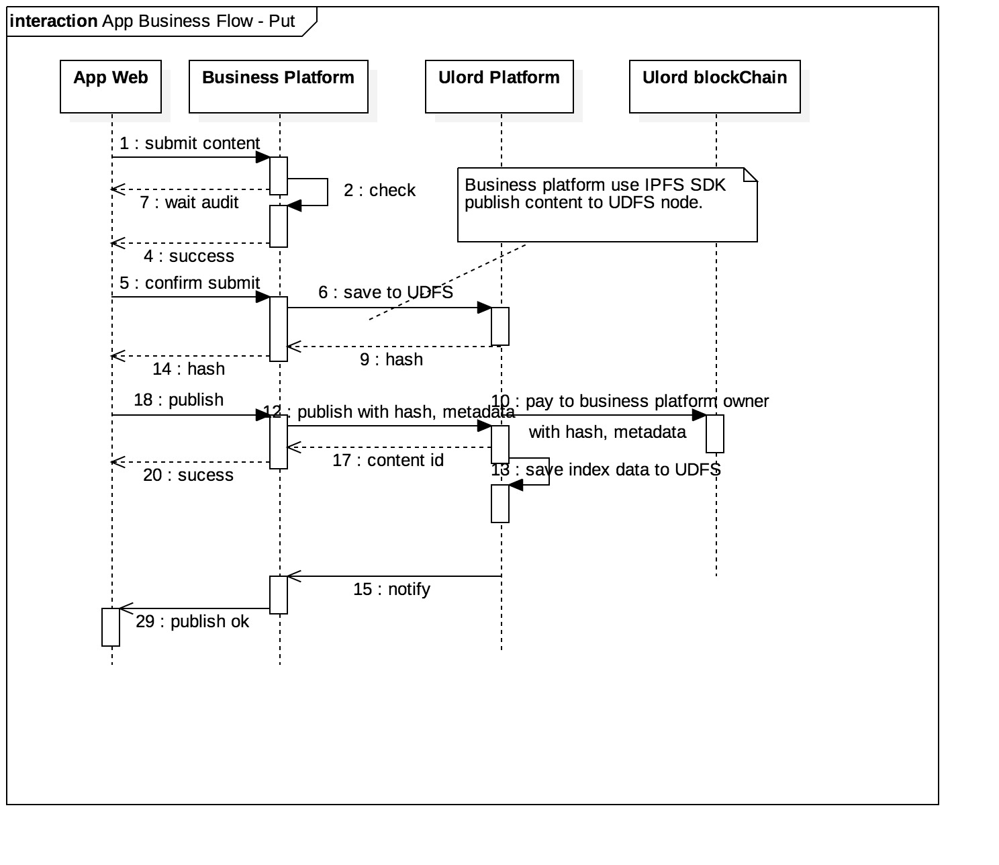

# Ulord Platform - The Most Powerfull Infrastructure for Content Distribution Applications
[英文](./README.md)

欢迎，这里是Ulurd平台原代码仓库！Ulord平台软件可以让开发者有能力创建和部署高性能，可水平扩展，基于区块链的内容分发应用。
目前代码仍在Alpah版本状态，并在快速开发中，欢迎加入！

Ulord是一个去中心化的内容分发平台，平台提供内容存储，内容检索和分发功能。平台可以承载不同的企业应用，提供给企业用户内容分发服务。
平台提供如下功能：
- 内容去中心化存储服务
- 内容交易服务
- 内容检索服务
平台提供如下保障：
- 内容归企业所有，只有具有企业私钥才可以访问企业内容
- 内容版权确认和内容审查由企业负责，平台提供技术实现
- 内容分发服务由平台提供

## Resources
1. [Ulord官网](http://ulord.one)
2. [文档](https://github.com/UlordChain/documentation)
3. [词汇表](./vocabulary.md)

## 平台架构
平台主要依托于Ulord区块链和先进开源技术融合实现内容存储，检索和分发功能。

用户从Ulord获取资源的流程图展示了用户获取数据的过程，以及各模块的交互。

用户从Ulord发布资源的流程图展示了用户发布数据的过程，以及各模块的交互。

### Ulord blockchain
Ulord区块链提供所有内容的交易记账服务，实现知识和币的记账，促进优质内容的传播。

### Ulord平台-功能最强大的内容分发应用基础设施
[英文](./README.md)

Ulord platform基于Ulord blockchain的记账功能，提供去中心化的内容存储，内容记账和内容检索服务。

### Ulord application
Ulord applictaion基于Ulord platform实现的内容相关行业的企业应用。他通过利用去中心化的Ulord platform，实现内容的快速分发，交易和检索功能。Ulord应用主要由企业实现的应用功能和Ulord platform提供的组建实现快速的基于内容的区块链技术开发。

## 钱包
Ulord平台的钱包分为两种，由于钱包由用户私钥，公钥和地址构成，对于普通用户而言，如果需要管理自己的私钥，非常的麻烦，Ulord平台提供代理钱包功能，用户通过其密钥可以控制平台保存的私钥和公钥。

### 为什么Ulord需要保存用户的钱包？
Ulord是一个内容分发平台，平台上所有的内容需要拥有者签名，如果用户终端具有签名功能，则用户必须具有钱包功能，将会导致所有用户的每一个Ulord应用都需要具有钱包功能。或者用户必须按照Ulord钱包App软件，实现签名和支付功能，这样用户的资产完成由用户自己管理。
所以Ulord平台提供两种钱包的实现：
1. 独立钱包+多个Ulord应用，应用通过钱包软件统一实现签名，支付，用户完成控制自己的私钥
2. 代理钱包+多个Ulord应用，应用通过Ulord代理钱包实现签名，支付，用户通过密钥控制Ulord平台的私钥

用户访问Ulord钱包功能时需要Google省份验证器实现双重认证。