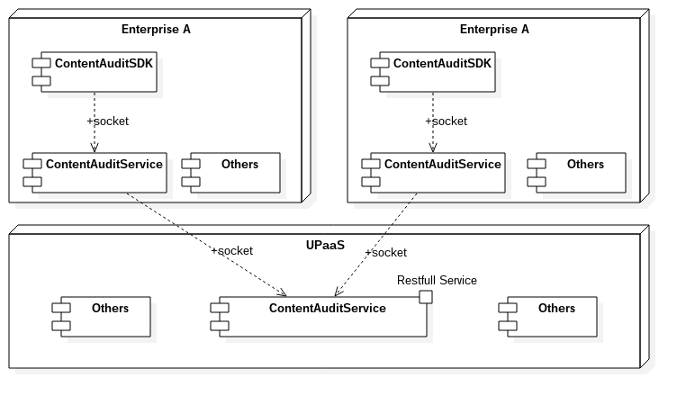

#Content Audit Service
[English](ulord_content_audit_service.md)

## 架构

Ulord内容审计分为两个部分，一部分在企业端，主要辅助企业完成内容审计，一部分在Ulord平台端，主要完成内容审计特征信息同步和主动发现功能。
Ulrod企业端分为两个部分，一个以服务方式运行的内容审计服务，他提供内容审计功能服务，同时保持和服务端的连接，实现全网内容设计特征同步。另一个以SDK形式提供，支持多种语言的
SDK，实现和内容审计服务对接。
内容审计服务运行在企业端有两个优点：
1. 内容原文只在企业端流转，不存在内容泄露问题；
2. 内容的传输在内网完成，具有高吞吐量的处理能力。

## Implementation

### The type of feature library

1. text feature library, including text and feature analysis of keywords and regular expressions
2. image feature library, mainly used to identify special types of pictures or text images.
3. audio and video feature library, feature library based on audio and video.

### Natural Language Processing

Text processing relies mainly on Natural Language Processing. This platform uses the natural language library of the open source project to realize Natural Language Processing function.

For details, please see: [HanLP] (https://github.com/hankcs/HanLP).
