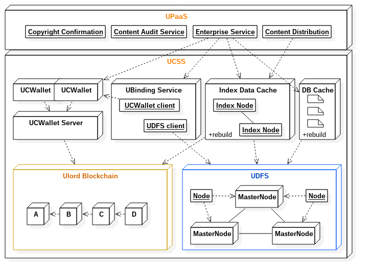
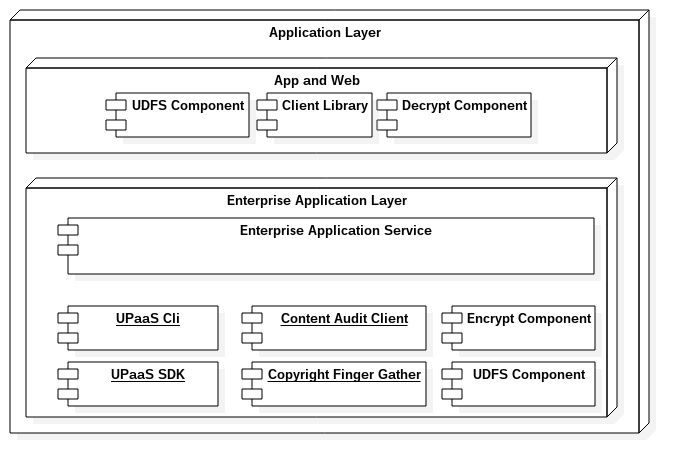

# Ulord Platform
[中文](./ulord_paas_zh.md)

Ulord Platform(UPaaS), for enterprises and individuals, it provides a blockchain platform with content distribution, as well as a content distribution service platform. UPaaS is built on the Ulord blockchain and the Ulord distributed file system (UDFS). UlordChain and UDFS constitute the UPaaS's content storage subsystem (Ulord Content Storage System, UCSS). UPaaS has a central managed purse wallet, we called UCWallet, which submit the transaction of the user managed account and add some content abstract to Ulord blockchain. It is a core subsystem of the UPaaS, and it is a distributed software, which can horizentionally adjust node number to meet the high concurrency request of the content transaction. We build a binding service (UBinding) base UCWallet and UDFS, which can bind content that come from UDFS and chain that come from Ulord blockchain. UBinding provide fast query services through the index data cache (Index Data Cache) and the relational database (DB Cache). UPaaS is based on UCWallet, UBinding, Index data cache and DB Cache to provide business services, copyright confirmation services, content audit services and content distribution services.

UPaaS System Architecture

## Ulord Content Storage System(UCSS)
Ulord content storage system mainly save file to Ulord distribute file system(UDFS), at same time write some abstract to ulord blockchain, we called Ulord Content Storage System(UCSS). 
The UCCS makes full use of the non tamperability of the blockchain transaction records, records the content abstract on the blockchain, realizes the ownership and timing of the content, and the user's content purchases records. The content in UDFS is linked by the summary information of the chain, and anyone can get resources and purchase resources from the chain. The information contained in the chain includes the content title, the summary and the enterprise information. Because the information on the chain is based on the currency address, it has the anonymity, and the content is stored on the UDFS as well. Therefore, only those who have the authority and the enterprise can obtain the relevant information of the content. UDFS is a storage system based on P2P network, which is mainly stored and distributed by the main node of the Ulord (see [whitepaper](https://github.com/UlordChain/Document/blob/master/whitepaper_en.pdf)). Each master node is the equivalent of the user's cloud storage space, where the desired content can be obtained everywhere.

### Ulord BlockChain
Ulord BlockChain is a public blockchain, supply transaction service like bitcoin.
More detail please to see[Ulord Project Document](https://github.com/UlordChain/UlordChain).

### Ulord Distribute File System（UDFS）
The Ulord distributed file system (UDFS) uses point to point network technology, DHT distributed hash table technology and version management technology, which is mainly inherited from the IPFS (interstellar file system).
The Ulord distributed file system builds a network independently and uses the storage service provided by the UlordChain master node (Master Node) to store and distribute the content. The enterprise application system participating in the system is also part of the UDFS system, and also participates in the content storage and distribution of the system.
Once the contents of the Ulrod are accepted by the network, the contents will not be lost or modified.

### Ulord Centeralized Wallet(UCWallet)
Ulord Centeralized Wallet（Ulord Centeralized/Content Wallet）mainly implements abstract information and content transaction information to the Ulord block chain, and provides controlled wallet automated signature transactions.
UCWallet uses distributed cluster deployment and optimizes wallet creation and transaction processes, enabling user creation and transactions to be executed quickly.
UCWallet is controlled by the user's payment password. UPaaS must control the wallet by paying the password.

### UBinding Service
UBinding services implement content association based on UDFS and UCWallet, and build index data (if necessary, index data can be reconstructed). UCWallet is only responsible for the interaction with the chain. UBinding needs to provide content ID to write UCWallet to the Ulord chain. UBinding provides index information for users, content and content transactions to facilitate enterprise users to quickly query content transaction information.
UBinding is delivered by calling the API of UCWallet and UDFS, including content writing to UDFS to obtain content ID, writing content ID and abstracts, author and other information into the block chain through UCWallet, and writing the updated information to the cache system.

### Index data cache
Index data cache is a very important part of the system design. UPaaS is a centralization platform. In theory, any enterprise or individual can deploy a set of UPaaS to build its own content distribution system or build its own business system based on UPaaS. In addition to the exclusive information of the enterprise, the information must be rebuilt to meet the needs of the business. Index data caching is mainly to solve the problem of system runtime efficiency. Any third party can build new index data cache through Ulord block chain and UDFS.

### Database Cache
Database Cache(DB Cache) is essential for UPaaS, because UPaaS's enterprise data is stored in the database cache. These data are databases of UPaaS official system, which can be encrypted and stored in UDFS to facilitate reconstruction or to consider backup independently. UPaaS's enterprise registration is an official service, and it provides mining and storage services by using the main node of Ulord. Under normal circumstances, enterprises can only make use of the services provided by UPaaS and Ulord by using the services provided by UPaaS. Here is a possibility to rebuild the new UPaaS.

## Ulord Platform as a Service（UPaaS）
The Ulord operating system is actually not a general operating system, but a system that borrows the concept of data and services provided by the operating system. UPaaS provides content storage and distribution services, including data storage, data processing and content distribution functions. UPaaS is built on UCSS, combined with enterprise services (Eterprise service), content validation (Copyright Confirmation), content audit (Content Audit Service) and content distribution (Content Distribution).

### Enterprise Service
Enterprise services provide enterprise registration, enterprise permissions, content label management, content transaction services and so on. It mainly serves the content release, distribution and query requirements of enterprise users. More new functions may be added in the future.

### Copyright confirmation service
The true service of copyright is a service used to confirm whether the content of the user has been uploaded, which is composed of two parts, one is the confirmation of the copyright information, and the other is the content fingerprint extraction service. UPaaS is based on the principle of designing the system without the original content. The content of the system is owned by the enterprise. The copyright confirmation service is based on the content fingerprint information to confirm the copyright, avoid the loss of the content on the network, and ensure the security of the user's information. The content fingerprint extraction service runs on the enterprise side, requiring the enterprise terminal to pass the copyright confirmation link before accepting the chain of content, so as to avoid later disputes. The fingerprint extraction service needs to get the original text, so it runs in the controlled environment of the enterprise. The process of extracting fingerprint information is irreversible, which means that fingerprint information can not restore the original text and ensure the security of the original text. Fingerprint source code is open source and is available for inspection.
The copyright confirmation service runs in the UPaaS system and accepts fingerprint information from different enterprise ends to ensure that the content does not flow between enterprises, affects the copyright of the original author, and solves the problem of copyright confirmation at the first time.

### Content Audit Service
Content review services are mainly filtering and early warning sensitive words to ensure that the content is distributed under a certain system.
As with copyright acknowledgement services, the content review service is also divided into two parts, the UPaaS main component sensitive vocabulary, synchronization to the enterprise end, and the implementation of the full network sensitive vocabulary synchronization review.
The review of audio and video content is currently under development. Please look forward to it.

### Content distribution
Content distribution service is mainly based on the advantages of UPaaS platform to promote effective dissemination of high-quality content and interoperability of content network and realize the maximization of content value.

## UPaaS Enterprise
The enterprise end is the core component of UPaaS. UPaaS provides enterprises with the need to rapidly develop applications based on content delivery.

