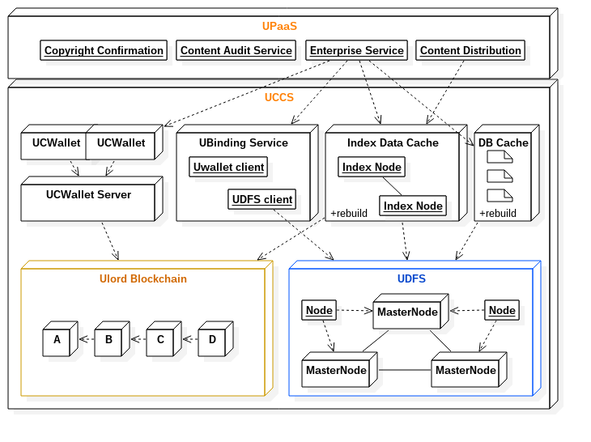
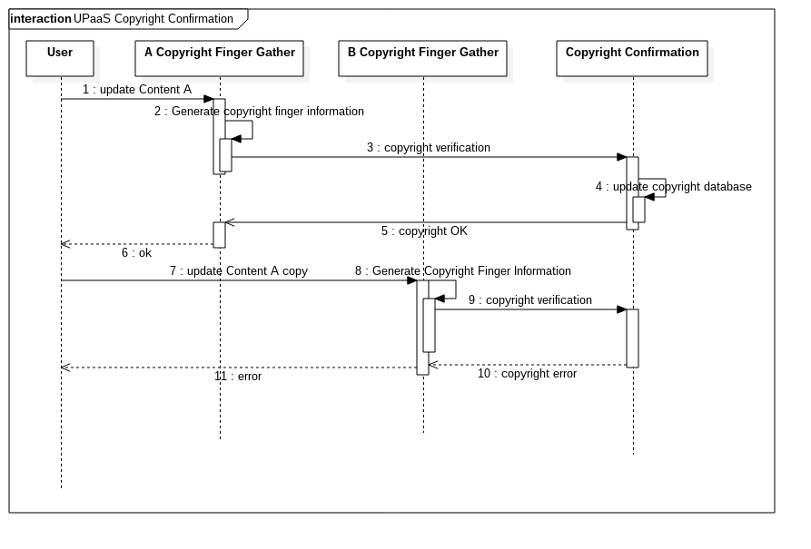
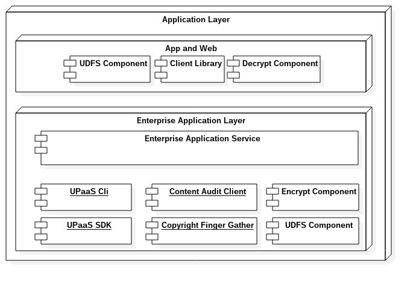

# Ulord Platform
[英文](./ulord_paas_en.md)

Ulord平台，又名UPaaS，面向企业和个人，提供内容分发的区块链平台，同时也是一个内容服务平台。
UPaaS基于Ulord公链和Ulord分布式文件系统（UDFS）构建，UlordChain和UDFS构成了UPaaS的内容存储子系统（Ulord Content Storage System, UCSS)。基于UlordChain，构建一个中心化托管钱包UCWallet，该钱包实现用户托管账户的交易，内容上链服务，是UPaaS的一个核心子系统，具有横向扩展能力，可以满足内容交易高并发要求。基于UCWallet和UDFS构建了一个内容和链的绑定服务（UBinding），实现链内容和区块链的绑定，并通过索引数据缓存（Index Data Cache）和关系型数据库（DB Cache）提供快速的查询服务。UPaaS基于UCWallet，UBinding，Index data cache和DB Cache构建，对外主要提供企业服务，版权确权服务，内容审计服务和内容分发服务。

UPaaS系统架构

## 内容存储子系统(UCSS)
内容存储子系统主要用于保存文件内容到Ulord分布式文件系统（UDFS），同时把内容摘要写入Ulord区块链，一同构成的子系统叫做内容存储子系统(UCSS)。UCSS组合Ulord区块链和UDFS提供可靠的、去中心化的内容存储服务。
存储子系统充分利用区块链交易记录的不可篡改性，记录关键信息在链上，实现内容的归属和时序性，用户内容购买记录存证。UDFS中的内容通过链的摘要信息进行关联，任何人可以获得链上产生的资源和购买的资源。链上信息包含的公开信息包括内容标题，摘要和企业信息，由于链上的信息是基于货币地址，因而具有匿名性，同时，内容存储在UDFS上也是经过加密处理的，因此，只有拥有权限的人和企业才可以获得内容的相关信息。UDFS是基于P2P网络的存储系统，主要由Ulord的主节点（参见[白皮书](https://github.com/UlordChain/Document/blob/master/whitepaper_zh.pdf)）承当内容的存储和分发，每一个主节点就是相当于用户的云存储空间，随处可以获得想要的内容。

### Ulord区块链
Ulord区块链是一个公链，提供类似比特币的所有交易服务，还提供包括内容相关的服务，主节点机制等服务。
具体文档请参见(项目文档)[https://github.com/UlordChain/UlordChain].

### Ulord分布式文件系统（UDFS）
Ulord分布式文件系统（UDFS）利用点对点网络技术，DHT分布式哈希表技术和版本管理技术构建的文件系统，主要继承于IPFS（星际文件系统）。
Ulord分布式文件系统独立构建一张网络，利用UlordChain主节点（Master Node）提供的存储服务，实现内容的存储和分发。参与系统的企业应用系统也是UDFS系统的一部分，也参与系统的内容存储和分发。
Ulrod的文件内容一旦被网络接受，内容将不会丢失，也无法修改。

### Ulord中心化托管钱包，UCWallet
Ulord中心化钱包（Ulord Centeralized/Content Wallet）主要实现向Ulord区块链写入摘要信息和内容交易信息，同时提供受控的钱包自动化签名交易。
UCWallet采用分布式集群部署，并优化钱包创建和交易流程，让用户创建和交易得以快速执行。
UCWallet由用户的支付密码控制，UPaaS必须通过支付密码才可以控制钱包。

### UBinding服务
UBinding服务基于UDFS和UCWallet实现内容的关联，并构建索引数据（必要时可以重建索引数据）。UCWallet只负责和链的交互，需要由UBinding提供内容ID给UCWallet写入Ulord链。UBinding提供用户，内容，内容交易的索引信息，方便企业用户快速查询内容交易信息。
UBinding通过调用UCWallet和UDFS的API实现交付，包括内容写入UDFS获取内容ID，将内容ID和摘要，作者等信息通过UCWallet写入区块链，同时把更新的信息写入缓存系统。

### 索引数据缓存
索引数据缓存（Index data cache）是系统设计中非常重要的一部分。UPaaS是一个去中心化的平台，理论上任何一个企业或者个人，均可以部署一套UPaaS来构建自己的内容分发系统，或者基于UPaaS构建自己的业务系统，那么除了企业专属信息外，信息必须可以重建，以满足业务需求。索引数据缓存主要是解决系统运行时效率问题，任何第三方均可以通过Ulord区块链和UDFS构建新的索引数据缓存。

### 数据库缓存
数据库缓存（DB Cache）是UPaaS必不可少的，因为UPaaS的企业数据均存储在数据库缓存中。这些数据是UPaaS官方系统的数据库，内容可以选择加密后存入UDFS，以方便重建，或者自主考虑备份。UPaaS的企业注册是官方提供的服务，并利用Ulord的主节点提供挖矿和存储服务。一般情况下，企业只需要借助UPaaS提供的企业服务功能，就可以利用Ulord和UPaaS提供的各种服务了。这里为重新搭建新的UPaaS提供一种可能。

## Ulord Platform as a Service（UPaaS）
Ulord操作系统其实并不是一般意义上的操作系统，而是借用操作系统提供数据和服务的概念的一个系统。UPaaS提供内容存储和分发服务，包括数据存储，数据处理和内容分发功能。UPaaS在UCSS之上构建，并结合企业服务（Eterprise service)，内容确权(Copyright Confirmation)，内容审计(Content Audit Service)和内容分发(Content Distribution)功能。

### 企业服务
企业服务提供企业注册，企业权限，内容标签等管理，内容交易服务等。主要服务于企业用户的内容发布，分发，查询需求。未来可能增加更多新功能。

### 版权确认服务
版权确实服务是用于确认用户上传的内容是否存在版权分险的一个服务，主要由两部分组成，一部分是版权信息确认服务，另一部分是内容指纹提取服务。UPaaS本着不涉及原始内容的原则设计系统，内容归企业所有，版权确认服务是基于内容指纹信息进行版权确认，避免内容流失在网络上，确保用户信息的安全。内容指纹提取服务运行在企业端，要求企业端在接受内容上链之前，必须经过版权确认环节，避免后期纠纷。指纹提取服务需要获得原文，因此在企业受控的环境中运行。提取指纹信息的过程是不可逆的，这意味着通过指纹信息是无法还原出原文的，确保了原文的安全性。指纹提过源代码是开源的，可供检验。
版权确认服务运行在UPaaS系统中，接受来自不同企业端的指纹信息，确保内容不会在各企业之间流窜，影响原作者的版权，并在第一时间解决版权确认问题。

### 内容审查服务
内容审查服务主要是对敏感词汇进行过滤和预警，确保内容在一定的制度下分发。
和版权确认服务一样，内容审查服务也分两个部分，UPaaS主要构件敏感词汇表，同步到企业端，实现全网敏感词汇同步审查。
对于音视频内容的审查目前正在研发中，敬请期待。

### 内容分发
内容分发服务主要是借助UPaaS平台优势，促进优质内容有效传播和内容全网互通，实现内容的价值最大化。

## UPaaS企业端
企业端是UPaaS的核心组成部分。UPaaS提供企业端快速开发基于内容分发领域应用所需。

## Q&A

### 内容存储如何去中心化？
众所周知，基于区块链技术很重要的一个特征就是去中心化，这意味着，写入区块链的交易具有不可篡改性。Ulord是一个区块链公链，则具有了公开的不可篡改性。Ulord区块链不仅为交易提供了一个去中心化交易系统，还提供了一个不可篡改性的分布式数据库。在Ulord平台层，Ulord区块链就是提供了交易服务和记账服务的一个数据库，为上层提供可靠的服务。

UDFS同样是一个去中心化的文件系统，内容由参与网络的各方实现内容的存储，虽然没有区块链一样的一致性共识算法来确保内容在全网统一。UDFS利用DHT技术构建一个唯一的文件片段ID，这个ID和区块链中的地址一样，通过哈希函数生产，具有理论上的唯一性，如果将ID公开，那么任何人均可以通过ID访问指向的资源。包括原作者也无法修改以前生成的ID，也没有办法让内容在网络中消失。如果需要修改内容，需要重新提交内容到UDFS，这样新的内容会生成一个新的ID。这样UDFS就提供了一个永久性的内容存储的文件存储空间。

一个去中心化的数据库和文件系统，在其上构建的应用将是天生具有区块链的优势的。

### 去中心化之后，效率如何保证？
传统的业务系统一般通过专业化的服务器和软件，例如磁盘阵列，小型机，提供可靠的计算资源，通过RetHat Linux， Windows Server， Oracle， SQLServer， DB2等专业的服务器软件和数据库系统，他们提供了文件系统服务和数据存储服务，同时提供了超高性能的计算能力和检索能力。虽然，通过去中心化解决了内容可靠存储，交易可验证等技术问题，对于业务系统而言，仍然需要一个较高性能的系统，才可以满足用户的需求。
正于目前做得好的区块链应用一样，对区块链数据建立有效的索引信息是加快业务性能的关键。区块链关键就是记录一个不可篡改的账本，并没有对查询进行特殊的优化，如果需要执行查询相关的业务，对一个不断增长的账本进行线性查询不是用户友好的方法。例如，在比特币或者以太坊币中查询一个用户地址的交易就是一个很好的例子，如果没有对用户地址的交易信息建立索引，那么查询一个用户的交易将需要遍历从第一个区块到当前最新区块的所有区块，解码交易，获得和用户地址相关的所有交易，在返回给用户，这个时间将是不可忍受的。所以，大部分区块链都提供了基本信息的索引信息库，提供基础查询能力。如果需要建立更复杂的交易信息，那么简单的索引将无法满足业务系统的需要，那么建立特定的索引系统，将是目前解决区块链效率问题的法宝。
建立索引是用空间换时间的经典方法，那么会影响区块链所具有的特性吗？答案是不会的。索引信息是建立在区块链账本记录之上的，任何一个人，在任意一个时间点均可以建立自己的索引信息，而且，建立索引的方法和索引的维度都可以不同。这意味着，即使索引信息丢失，只要保留建立索引的方法，可以从账本信息中重建索引。
有了一个可以重建的索引，用索引信息加快业务系统执行速度就是UPaaS解决性能问题的核心方法。

### 内容没法删除吗？
这是一个哲学问题。理论上，基于区块链的技术，只要信息被网络记录，信息将永远不会消失。那内容如果必须要删除如何解决呢？其实这个问题其实也不是没有办法解决。如果内容存在网络上，可是大家找不到它，那么实际上它就是不存在了。比如，早期比特币持有者把自己的私钥丢了，那么那些比特币就永远无法找到了，尽管这些信息永久的记录在区块链中，可是比特币就等于删除了。如果内容记录在网络中，可是打开内容的钥匙丢了，那么内容就等同于消失了。还有一种方法可以内容消失的方法就是让大家都看不到它。例如，如果一篇博客，如果无法被搜索引擎找到，那么这篇博客就等于消失在网络中了，就像你电脑上的某个照片，你不记得文件名，也不记得位置，那么这张照片无异于丢失了。
UDFS的内容可以通过密钥加密，如果密钥丢失，那么内容将永久无法打开。另外，UDFS的网关（提供内容获取的门户）可以执行黑名单检测（具有一致性的行为，类似于共识算法一样），从而实现内容的“检索消失”。

## 内容索引子系统
内容的产生，是极其迅速的，目前已经呈现出指数增长形态，那么有效，高质量内容的传播除依赖人与人之间传播外，高效，客观的搜索引擎是解决目前内容大爆炸情况下的一个有效手段。Google的PageRank算法解决了网页的质量问题。UPaaS创新的尝试通过经济模型解决内容质量问题，同时还需要一个有效的手段确保内容可迅速检索和获得，这就需要一个索引系统来解决内容的发现问题。
内容搜索引擎不同于Google，Baidu等搜素引擎，常规的搜索引擎除具有超高的技术手段外，还具有资源积累优势。在Ulord中，内容的产生和消费都是去中心化的，这意味着，任何一个企业和个人是可以参与内容索引系统的建设的。每一个索引系统都可以依据自己面向资源的特性构建特定的索引系统。换句话说，内容索引子系统也是“去中心化的”。在某一点或者某一时刻，索引系统是中心化的，只有中心化的，才可以提供一个较好的体验。

### 如何构建索引系统？
UPaaS基于Ulord区块链和UDFS构建的，用户通过对区块链进行索引，检索到内容的摘要后，就可以依据摘要信息进行内容检索了，全文检索必须由内容产生的企业端进行，其他用户只能通过内容产生的源头提供的服务进行全文检索。摘要信息中包含了全文内容ID（CID，或者ClaimID），如果内容没有加密，用户可以通过CID直接获取全文进行查看和内容索引。如果已经加密，将无法通过直接打开内容，需要由内容发起方提供密钥或者定制的软件才可以获得内容。

### 索引系统和一般索引有何不同呢？
在互联网时代，流量为王，所以各大互联网公司都通过各种方式产生，吸引流量，实现价值转化。与此同时，流量壁垒导致的用户体验差和流失也是一大痛点。UPaaS建立的内容分发系统，利用去中心化的区块链技术，各参与企业可以利用UPaaS的优势，可以很容易的获得其他企业或用户产生的内容，用户也可以游弋于内容的海洋，享受高质量知识的馈赠，相当于打通内容分发的任督二脉。例如，一个电影在优酷上独家播出，那么如果在腾讯视频上可以检索到，可是如果需要直接看这个视频，目前都是通过腾讯视频打开优酷的网页版进行播放，用户体验极差，甚至，用户必须注册优酷App才可以正常观看。如果这个电影在A企业产生，任何企业可以查看内容的摘要，如果用户在企业B系统中，需要观看A企业电影，用户可以直接在B企业上购买资源，直接查看。这里的流程如下，用户在企业B系统上通过UPaaS可以直接购买A企业的电影，A企业授权B企业资源密钥，这样，内容就和在企业B上直接查看得到的一样的用户体验。用户流量也在企业间是互通的。同时，这样有一个优势就是，分工更加明确。比如一个记者，可以写出有深度的调查报告，那么它只需要把内容分发到UPaaS上，报告的索引和分发将有具有用户流量的公司完成。这正是UPaaS和索引技术相结合的一个优势，也是和一般索引不同的地方。

