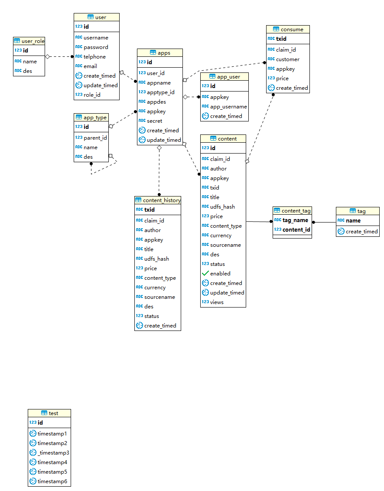

[TOC]


----------


# 一. API平台管理界面相关接口(内部接口)

#### 说明: 先登录获取token, 然后将其添加到请求headers中, 格式如下
```
Authorization:Bearer token值
```

### 获取注册登录等时用于密码rsa加密的公钥  `POST`    `/v1/getpubkey`
```
# 请求参数:
无

# 返回值:

成功
{
    "errcode": 0,
    "reason": "success",
    "result": "-----BEGIN PUBLIC KEY-----\nMIGfMA0GCSqGSIb3DQEBAQUAA4GNADCBiQKBgQDwEYW1eX0JZEraQIxRUOsRYOL2\n9AXVFhjQZt0zhMNusgxo49zgU162+SwxIesp1KDwN4QI6ov1rIuxlYMELOh0zIRZ\npLEWBm9khyhIyNT6et1r4y0QQrqc01ZuwiODezb0q+0bHn5zsezAXkV9VMe2p1DB\nvk/7uGmIrz5E8AOLbQIDAQAB\n-----END PUBLIC KEY-----"
}
```


### 1. 用户角色接口

##### A. **[管理员]**角色添加  `POST`    `/v1/role/add`
```
# 请求参数:

{
	"name": 角色名,
	"des": 角色描述
}

# 返回值:

成功
{
    "errcode": 0,
    "reason": "success",
    "result": {
        "id": 11
    }
}
```

##### B. **[管理员]**角色列表  `GET`    `/v1/role/list/<page>/<num>`
```
# 请求参数:
page: 当前页
num: 每页条数

# 返回值:

成功
{
    "errcode": 0,
    "reason": "success",
    "result": {
        "pages": 1,
        "records": [
            {
                "des": "管理员",
                "id": 4,
                "name": "admin"
            },
            {
                "des": "标准用户",
                "id": 7,
                "name": "normal"
            },
            {
                "des": "封禁用户",
                "id": 8,
                "name": "blocked"
            }
        ],
        "total": 3
    }
}
```

##### C. **[管理员]**角色修改  `POST`    `/v1/role/edit`
```
# 请求参数:

{
    "id":id值,
	"name": 角色名,
	"des":角色描述
}

# 返回值:

成功
{
    "errcode": 0,
    "reason": "success",
}
```

##### D. **[管理员]**角色删除  `POST`    `/v1/role/remove`
```
# 请求参数:

{
    "id":id值,
}

# 返回值:

成功
{
    "errcode": 0,
    "reason": "success",
    "result": {
        "num": 1
    }
}
```


### 2. 应用类型接口

##### A. **[管理员]**类型添加  `POST`    `/v1/type/add`
```
# 请求参数:

{
    "parent_id":4,  # 顶级分类不需要此参数
    "name":类型名,
    "des":类型描述,
}

# 返回值:

成功
{
    "errcode": 0,
    "reason": "success",
    "result": {
        "id": 1
    }
}
```

##### B. 类型列表  `GET`    `/v1/type/list`
```
# 请求参数:

无

# 返回值:

成功
{ # 无限多级分类
    "errcode": 0,
    "reason": "success",
    "result": [
        {
            "children": [
                {
                    "des": "boke",
                    "id": 7,
                    "name": "博客",
                    "parent_id": 2
                }
            ],
            "des": "博客,论坛等等",
            "id": 2,
            "name": "文字",
            "parent_id": null
        },
        {
            "des": "图片",
            "id": 3,
            "name": "图片",
            "parent_id": null
        }
    ]
}
}
```

##### C. **[管理员]**类型修改  `POST`    `/v1/type/edit`
```
# 请求参数:

{
    "id":id值,
    "des":类型描述,
    "parent_id":父类id,
}

# 返回值:

成功
{
    "errcode": 0,
    "reason": "success",
}
```

##### D. **[管理员]**类型删除  `POST`    `/v1/type/remove`
```
# 请求参数:

{
    "id":id值,
}

# 返回值:

成功
{
    "errcode": 0,
    "reason": "success",
    "result":{
        "num":1,
    }
}
```

### 3. 用户帐号接口

##### A. 用户注册  `POST`    `/v1/users/reg`
```
# 请求参数:

{
    "username":开发这帐号,
    "password":rsa加密后再base64编码,
    "email":邮箱(可空),
    "telphone":电话(可空),
}

# 返回值:

成功
{
    "errcode": 0,
    "reason": "success",
    "result":{
        "id":1,
    }
}
失败
{
    "errcode": 20100,
    "reason": "参数错误.",
    "result": {
        "password": [
            "Field must be between 6 and 128 characters long."
        ],
        "username": [
            "Field must be between 3 and 32 characters long."
        ]
    }
}
```

##### B. 用户登录  `POST`    `/v1/users/login`
```
# 请求参数:

{
    "username":开发这帐号,
    "password":rsa加密后再base64编码,
}

# 返回值:

成功
{
    "errcode": 0,
    "reason": "success",
    "result":{
        "token":token,
    }
}
```

##### C. 用户密码修改  `POST`    `/v1/users/changepassword`
```
# 请求参数:

{
    "password":原密码(rsa加密后再base64编码),
    "new_password":新密码(rsa加密后再base64编码),
}

# 返回值:

成功
{
    "errcode": 0,
    "reason": "success",
}
```

##### D. 用户资料修改  `POST`    `/v1/users/edit`
```
# 请求参数:

{
    "telphone":开发这帐号(选填),
    "email":帐号密码(选填),
}

# 返回值:

成功
{
    "errcode": 0,
    "reason": "success",
}
```

##### E. **[管理员]**修改用户角色  `POST`    `/v1/users/role/edit`
```
# 请求参数:

{
    "id":要修改的用户id,
    "role_id":角色id
}

# 返回值:

成功
{
    "errcode": 0,
    "reason": "success",
}
```

##### F. **[管理员]**获取用户列表  `POST`|`GET`    `/v1/users/list/<page>/<num>`
```
# 请求参数:
1. GET: 无参数, 查询所有用户列表
2. POST:
{
    "username":用户名(模糊查询),
}

# 返回值:

成功
{
    "errcode": 0,
    "reason": "success",
    "result": {
        "pages": 1,
        "records": [
            {
                "create_timed": "2018-05-26 08:51:07",
                "create_timed_timestamp": 1527295867,
                "email": null,
                "id": 49,
                "role": 4,
                "telphone": null,
                "update_timed": "2018-05-26 09:03:19",
                "update_timed_timestamp": 1527296599,
                "username": "admin"
            }
        ],
        "total": 7
    }
}
```

### 4. 应用接口

##### A. 应用添加  `POST`    `/v1/app/add`
```
# 请求参数:

{
    "appname":应用名称,
    "apptype_id":应用类型id,
    "appdes":应用描述,
}

# 返回值:

成功
{
    "errcode": 0,
    "reason": "success",
    "result": {
        "id": 12,
        "appkey": "b4a5fe5e4f7411e8ad76f48e3889c8ab",
        "secret": "b4a5fe5f4f7411e8a7fbf48e3889c8ab"
    }
}
```

##### B. 应用列表  `GET`    `/v1/app/list/<page>/<num>`
```
# 请求参数:
无

# 返回值:

成功
{
    "errcode": 0,
    "reason": "success",
    "result": {
        "pages": 1,
        "total": 1,
        "records": [
            {
                "appdes": "appdes",
                "appkey": "b0d2a95e4f6b11e88c1ff48e3889c8ab",
                "appname": "个人博客",
                "create_timed": "2018-05-04 15:20:58",
                "create_timed_timestamp": 1525418458,
                "id": 11,
                "secret": "b0d2a95f4f6b11e89b6bf48e3889c8ab",
                "type": 2,
                "update_timed": null
            }
        ]
    }
}
```

##### C. 应用重新生成secret  `POST`    `/v1/app/rebuild`
```
# 请求参数:

{
    "id":应用id,
}

# 返回值:

成功
{
    "errcode": 0,
    "reason": "success",
    "result":{
        "secret":签名私钥,
    }
}
```

##### D. 应用信息修改  `POST`    `/v1/app/edit`
```
# 请求参数:

{
    "id":应用id,
    "appdes":应用描述
}

# 返回值:

成功
{
    "errcode": 0,
    "reason": "success"
}
```

##### E. 应用删除  `POST`    `/v1/app/remove`
```
# 请求参数:

{
    "id":3,
}

# 返回值:

成功
{
    "errcode": 0,
    "reason": "success",
    "result":{
        "num":删除条数,
    }
}
```


# 二. API平台外部调用接口

#### 说明: 将appkey值将如到请求头headers中.如: `U-AppKey:37fd0c5e3eeb11e8a12af48e3889c8ab`
​
### 交易相关

##### 1. 创建钱包  `POST`    `/v1/transactions/createwallet`
```
# 请求参数:

{
    "username": 钱包用户名,
    "pay_passwrod":支付密码
}U-AppKey

# 返回值:

成功
{
    "errcode": 0,
    "reason": "success",
}
```

##### 2. 转账  `POST`    `/v1/transactions/paytouser`
```
# 请求参数:
# 第一种转账方式(开发者给用户转账)
{
    'is_developer':true,
    'recv_user': 转账的接收用户,
    'amount':金额,
}
# 第二种转账方式(用户之间转账)
{
	'is_developer':false,  # 也可以不传此参数
    'send_user':转账的支付用户,
    'pay_password':转账支付密码,
    'recv_user': 转账的接收用户,
    'amount':金额,
}
# 返回值:

成功
{
    "errcode": 0,
    "reason": "success",
}
```


##### 3. 查询余额  `POST`    `/v1/transactions/balance`
```
# 请求参数:

{
        'username':消费者用户名,
        'pay_password':支付密码(在创建用户时指定的),
}

# 返回值:

成功
{
    "errcode": 0,
    "reason": "success",
    "result":{
        "total":总余额,
        "confirmed":已确认余额,
        "unconfirmed":未确认余额,
        "unmatured":未成熟的余额(挖矿所得,100个块才成熟),
    }
}
```

##### 4. 发布资源  `POST`    `/v1/transactions/publish`
```
# 请求参数:

{
        'author': 发布者用户名,
        'pay_password': 支付密码,
        'title': 资源标题,
        'tags': 标签列表,
        'udfs_hash': Ulord文件系统哈希,
        'price': 定价,
        'content_type': 资源类型(文件后缀名),
        'description':资源描述
}

# 返回值:

成功
{
    "errcode": 0,
    "reason": "success",
    "result":{
        "id":数据库id,
        "claim_id":资源在链上的id,
    }
}
```

##### 4.1. 更新资源  `POST`    `/v1/transactions/publish`
```
# 请求参数:
{
        "id" : "30",  # 资源在db中的id
        "pay_password": "123",  # 支付密码
        "title": "update blog",
        "tags": ["C++","C#"],
        "udfs_hash": "WmVcVaHhMeWNNetSLTZArmqaHMpu5ycqntx7mFZaci63VF",
        "price": 1.2,
        "content_type": ".exe",
        "description":"update blog description"
}

# 返回值:

成功
{
    "errcode": 0,
    "reason": "success",
    "result":{
        "id":数据库id,
        "claim_id":资源在链上的id,
    }
}
```

##### 5. 检查是否付费  `POST`    `/v1/transactions/check`
```
# 请求参数:

{
        "customer":"user2",
        "claim_ids":[
        	"25e48b12694b4704aeff32ba0a568c21ad8dd5d6",
        	"2d4bbaf369464feeb90ac957af72a641f9a1bc9c",
        	"e1b98bcc018950ac4684c663d0ea4fa9fc19543d"
    	]
}

# 返回值:

成功
{
    "errcode": 0,
    "reason": "success",
    "result": {
        "25e48b12694b4704aeff32ba0a568c21ad8dd5d6": "QmUH2NbKrURA6hAmJnhfP4VTDtkjUs3fVCN2L7DoE3JLmm",
        "2d4bbaf369464feeb90ac957af72a641f9a1bc9c": false,  # 未付费
        "e1b98bcc018950ac4684c663d0ea4fa9fc19543d": null,  # 没有此记录
    }
}
```

##### 6. 消费资源  `POST`    `/v1/transactions/consume`
```
# 请求参数:

{
        'customer':消费者用户名,
        'claim_id':'45cdb43d78bd12ee3acfa9be7c56ae02d6c88d3e'
        'customer_pay_password':消费密码(登录用户的支付密码,消费正常资源时传入),
        "author_pay_password":资源发布者的支付密码(点击广告时传入)
}

# 返回值:

成功
{
    "errcode": 0,
    "reason": "success",
    "result":{
        "udfs_hash":ulord文件系统hash值,
    }
}
```

##### 7. 收入账单  `POST`    `/v1/transactions/account/in/<page>/<num>`
```
# 请求参数:
{
    'username':719355782, # 用户名称
    'category':0,  # 0:资源收入(发布), 1: 广告收入(消费). 不传参: 所有收入
    "sdate":"2018-03-29",  # 开始时间
    "edate":"2018-03-29"   # 结束时间
}

# 返回值:

成功
{
    "errcode": 0,
    "reason": "success",
    "result": {
        "pages": 1,
        "records": [
            {  # 用户作为消费者, 点击广告收入
                "author": "yyy",
                "claim_id": "798aedf4fab2fa77a77b56528abe6e50afce37e6",
                "create_timed": "2018-04-21T13:37:41.983595+00:00",
                "create_timed_timestamp": 1527560581,
                "customer": "719355782",
                "enabled": true,
                "id": 3,
                "price": 0.6,
                "title": "666",
                "txid": "d162db3c4185720d287b7fabbe560546c9bce06f0812fadeb9d78c8d0fe2a2aa"
            },
            {  # 用户作为发布者, 发布资源收入
                "author": "719355782",
                "claim_id": "870c3a35a8b82f1d4f8e89b89b5c7d3b80d6bc5b",
                "create_timed": "2018-04-21T09:47:05.902228+00:00",
                "create_timed_timestamp": 1527560581,
                "customer": "zyding",
                "enabled": true,
                "id": 3,
                "price": 0.525,
                "title": "123123123123",
                "txid": "b781f7c12aa7b7a43c22a5bea2ac56d6d15a1dbde7eeea9e2774f7e5f168df56"
            }
        ],
        "total": 2
    }
}
```


##### 8. 支出账单  `POST`    `/v1/transactions/account/out/<page>/<num>`
```
# 请求参数:
{
    'username':719355782,  # 用户
    'category':0,  # 0:资源收入(发布), 1: 广告收入(消费). 不传参: 所有收入
    "sdate":"2018-03-29",  # 开始时间
    "edate":"2018-03-29"   # 结束时间
}

# 返回值:

成功
{
    "errcode": 0,
    "reason": "success",
    "result": {
        "pages": 1,
        "records": [
            {  # 用户作为发布者 支出广告费
                "author": "719355782",  # 发布者
                "claim_id": "870c3a35a8b82f1d4f8e89b89b5c7d3b80d6bc5b",
                "create_timed": "2018-04-21T08:39:25.883777+00:00",
                "create_timed_timestamp": 1527560581,
                "customer": "935827234",  # 消费者
                "enabled": true,
                "id": 3,
                "price": 0.525,  # 交易金额
                "title": "123123123123",
                "txid": "31af05db89decfcd561ba79fbd130aacb8f02de4b75e55f4548626c1d9732c51"
            },
            {  # 用户作为消费者, 支出资源消费
                "author": "tttttttttttt",
                "claim_id": "010d23be8ce1e23da9dad94c61618d1e0b484c77",
                "create_timed": "2018-04-21T11:55:43.680047+00:00",
                "create_timed_timestamp": 1527560581,
                "customer": "719355782",
                "enabled": true,
                "id": 3,
                "price": 0.02,
                "title": "the first blog",
                "txid": "f672a32a11c1eb82a7a1b17e93bc823132c7bc75c3ed990fd1e797c8a11fbe50"
            }
        ],
        "total": 2
    }
}
```

##### 9. 收支账单(收入和支出账单合二为一)  `POST`    `/v1/transactions/account/inout/<page>/<num>`
```
# 请求参数:
{
    'username':719355782  # 用户
}

# 返回值:

成功
{
    "errcode": 0,
    "reason": "success",
    "result": {
        "pages": 1,
        "records": [
            {  # 作为发布者, price正为资源收入
                "author": "719355782",
                "claim_id": "1eaeee8108d2ddeefebd5dc811c3722857e32165",
                "create_timed": "2018-04-21T08:40:07.045958+00:00",
                "create_timed_timestamp": 1527559975,
                "customer": "935827234",
                "enabled": true,
                "id": 2,
                "price": 0.65255,
                "title": "测试1111111",
                "txid": "346bb03f63287b8c19ff0deee42ffe561d266beaeea80cff58f8098c4a4f42ab"
            },
            {  # 作为发布者, price负为广告支出
                "author": "719355782",
                "claim_id": "ca067e452618915fab2d33cdb6cecca83ae95659",
                "create_timed": "2018-04-20T16:10:25.831104+00:00",
                "create_timed_timestamp": 1527559975,
                "customer": "uuu",
                "enabled": true,
                "id": 1,
                "price": -0.5,
                "title": "df",
                "txid": "d70c00b042b0fabd9279290f72af233d7e50f3092a0c341b05b3a7fc5cd784be"
            },
            {  #作为消费者, price正为资源支出
                "author": "tttttttttttt",
                "claim_id": "010d23be8ce1e23da9dad94c61618d1e0b484c77",
                "create_timed": "2018-04-20T16:09:38.522716+00:00",
                "create_timed_timestamp": 1527559975,
                "customer": "uuu",
                "enabled": true,
                "id": 3,
                "price": 0.02,
                "title": "the first blog",
                "txid": "1b05ff6234eb95f5836afe6e8caf2617206d1f0d540c3798d8a2004f1ac0e299"
            },
            {  # 作为消费者, price负为广告收入
                "author": "yyy",
                "claim_id": "798aedf4fab2fa77a77b56528abe6e50afce37e6",
                "create_timed": "2018-04-20T15:55:16.285238+00:00",
                "create_timed_timestamp": 1527559975,
                "customer": "uuu",
                "enabled": true,
                "id": 4,
                "price": -0.6,
                "title": "666",
                "txid": "851ecf55bd841322683a18a427fa69e6c6c49af8009c89ced6f0c1c12a620455"
            }
        ],
        "total": 6
    }
}
```

##### 10. 收支总额  `POST`    `/v1/transactions/account`
```
# 请求参数:
{
    'username':登录用户,
    "sdate":"2018-03-29",  # 开始时间
    "edate":"2018-03-29"   # 结束时间
}

# 返回值:

成功
{
    "errcode": 0,
    "reason": "success",
    "result": {
        "customer_out": {  # 消费者支出
            "count": 0,
            "sum": null
        },
        "customer_in": {  # 消费者收入
            "count": 0,
            "sum": null
        },
        "publisher_out": {  # 发布者支出
            "count": 2,
            "sum": 0.04
        },
        "publisher_in": {  # 发布者收入
            "count": 0,
            "sum": null
        }
    }
}
```

##### 11. 发布资源总数  `POST`    `/v1/transactions/publish/count`
```
# 请求参数:
{
    'author':发布者,
    "sdate":"2018-03-29",  # 开始时间
    "edate":"2018-03-29"   # 结束时间
}

# 返回值:

成功
{
    "errcode": 0,
    "reason": "success",
    "result": {
        "count": 3
    }
}
```


### 资源相关

##### 1. id查询资源: 根据指定ID列表返回内容列表  `POST`    `/v1/content/gets`
```
# 请求参数:
{
  "ids":["3"]
}

# 返回值:

成功
{
    "errcode": 0,
    "reason": "success",
    "result": [
        {
            "author": "uuui",
            "claim_id": "d4bf1290eb6cd4ad7f1f699b555aeaf3c44d4170",
            "content_type": ".txt",
            "create_timed": "2018-05-29 09:37:53",
            "create_timed_timestamp": 1527557873,
            "currency": "UT",
            "des": "des",
            "enabled": true,
            "id": 3,
            "price": 0.2,
            "status": 1,
            "tags": [
                "ul"
            ],
            "title": "uui action",
            "update_timed": null,
            "update_timed_timestamp": null
        }
    ]
}
```


##### 2. 资源列表查询  `GET`|`POST`    `/v1/content/list/<page>/<num>`
```
# 请求参数:
`GET`: 不传参, 查询所有资源
`POST`: title模糊查询
{
  "keyword":"7"  # 查询关键字
}

# 返回值:

成功
{
    "errcode": 0,
    "reason": "success",
    "result": {
        "pages": 1,
        "records": [
            {
                "author": "pppl",
                "claim_id": "436b1ddfc3c662704d4795d16d3ac6be99505cec",
                "content_type": ".txt",
                "create_timed": "2018-05-29 11:26:34",
                "create_timed_timestamp": 1527564394,
                "currency": "UT",
                "des": "74",
                "enabled": true,
                "id": 17,
                "price": 0.01,
                "status": 1,
                "tags": [
                    "8"
                ],
                "title": "774",
                "update_timed": null,
                "update_timed_timestamp": null
            }
        ],
        "total": 2
    }
}
```

##### 3. 用户已发布资源列表  `POST`    `/v1/content/publish/list/<page>/<num>`
```
# 请求参数:
{
    'author':uuui  # 消费者
}

# 返回值:

成功
{
    "errcode": 0,
    "reason": "success",
    "result": {
        "pages": 1,
        "records": [
            {
                "author": "uuui",
                "claim_id": "d4bf1290eb6cd4ad7f1f699b555aeaf3c44d4170",
                "content_type": ".txt",
                "create_timed": "2018-05-29 09:37:53",
                "create_timed_timestamp": 1527557873,
                "currency": "UT",
                "des": "description",
                "enabled": true,  # 资源是否可用
                "id": 3,
                "price": 0.2,
                "status": 1,
                "tags": [
                    "python"
                ],
                "title": "first blog",
                "update_timed": null,
                "update_timed_timestamp": null
            }
        ],
        "total": 1
    }
}
```


##### 4. 单个资源相关的所有消费记录  `POST`    `/v1/content/claim/list/<page>/<num>`
```
# 请求参数:
{
  "claim_id":"d4bf1290eb6cd4ad7f1f699b555aeaf3c44d4170"
}

# 返回值:

成功
{
    "errcode": 0,
    "reason": "success",
    "result": {
        "pages": 1,
        "records": [
            {
                "create_timed": "2018-05-29 10:23:01",
                "create_timed_timestamp": 1527560581,
                "customer": "pppl",
                "price": 0.2,
                "txid": "96ebee14cde7dab123291479d7ac06a4bbacd17d475348970019e0ad063695a2"
            },
            {
                "create_timed": "2018-05-29 10:12:55",
                "create_timed_timestamp": 1527559975,
                "customer": "user8",
                "price": 0.2,
                "txid": "48e328e3926faf2f56609651a26d4d4d1c51067699f65d6dfed737716c49725d"
            }
        ],
        "total": 2
    }
}
```

##### 5. 单资源统计信息  `POST`    `/v1/content/claim/account`
```
# 请求参数:
{
  "claim_ids": ["d4bf1290eb6cd4ad7f1f699b555aeaf3c44d4170",
                "89d66734481dc8f8279f0f3c724be78352d3f2c6",
                "c0d9a0a410fa9c1872398791412c1f31e0b27519"]
}

# 返回值:

成功
{
    "errcode": 0,
    "reason": "success",
    "result": [
        {
            "claim_id": "89d66734481dc8f8279f0f3c724be78352d3f2c6",
            "count": 2,  # 消费次数
            "sum": 0.88  # 收支总额
        },
        {
            "claim_id": "c0d9a0a410fa9c1872398791412c1f31e0b27519",
            "count": 1,
            "sum": -0.5
        },
        {
            "claim_id": "d4bf1290eb6cd4ad7f1f699b555aeaf3c44d4170",
            "count": 5,
            "sum": 1
        }
    ]
}
```

### 附录A: 错误码对照表
```
ulord平台错误码:
{
    # 正常
    0:{'errcode':0,'reason':'success'},  # 可以重写reason与result内容

    # HTTP协议错误码
    400:{'errcode':400,'reason':'Bad Request.'},
    401:{'errcode':401,'reason':'Authentication Required.'},
    403:{'errcode':403,'reason':'Forbidden.'},
    404:{'errcode':404,'reason':'Not found.'},
    405:{'errcode':405,'reason':'Method Not Allowed.'},
    500:{'errcode':500,'reason':'Internal Server Error.'},

    # 系统级错误码
    10001:{'errcode':10001,'reason':'错误的请求KEY.'},
    10002:{'errcode':10002,'reason':'该KEY无请求权限.'},
    10003:{'errcode':10003,'reason':'KEY过期.'},
    10004:{'errcode':10004,'reason':'被禁止的IP.'},
    10005:{'errcode':10005,'reason':'被禁止的KEY.'},
    10006:{'errcode':10006,'reason':'当前IP请求超过限制.'},
    10007:{'errcode':10007,'reason':'请求超过次数限制.'},
    10008:{'errcode':10008,'reason':'系统内部异常.'},
    10009:{'errcode':10009,'reason':'接口维护.'},
    10010:{'errcode':10010,'reason':'接口停用.'},
    10011:{'errcode':10011,'reason':'当前没有登录用户,请登录.'},
    10012:{'errcode':10012,'reason':'缺少应用KEY值.'},
    10013:{'errcode':10013,'reason':'无权限进行此操作.'},
    10014:{'errcode':10014,'reason':'需要管理员权限.'},
    10015:{'errcode':10015,'reason':'用户被禁用.'},
    10016:{'errcode':10016,'reason':'用户可新建的uapp数量已达最大数.'},
    10017:{'errcode':10017,'reason':'此请求已过期.'},

    # 服务级错误码
    # 1. DB查询验证
    20000:{'errcode':20000,'reason':'用户已存在.'},
    20001:{'errcode':20001,'reason':'邮箱已存在.'},
    20002:{'errcode':20002,'reason':'应用名已存在.'},
    20003:{'errcode':20003,'reason':'用户不存在.'},
    20004:{'errcode':20004,'reason':'密码错误.'},
    20005:{'errcode':20005,'reason':'数据不存在.'},
    20006:{'errcode':20006,'reason':'用户被禁用.'},
    20007:{'errcode':20007,'reason':'资源不存在.'},
    20008:{'errcode':20008,'reason':'资源需付费.'},
    20009:{'errcode':20009,'reason':'加密参数不合要求.'},
    20010:{'errcode':20010,'reason':'密码长度不符合要求,请输入3-128位长度.'},

    # 2. 请求参数验证相关
    20100:{'errcode':20100,'reason':'参数错误.'},
    20101:{'errcode':20101,'reason':'参数必须为json格式.'},
    20102:{'errcode':20102,'reason':'签名错误.'},
    # 3. 钱包相关接口调用
    20200:{'errcode':20200,'reason':'调用钱包接口失败.'},
    20201:{'errcode':20201,'reason':'资源发布失败.'},
    20202:{'errcode':20202,'reason':'资源消费失败.'},
    20203:{'errcode':20203,'reason':'查询余额失败.'},
    20204:{'errcode':20204,'reason':'创建钱包失败.'},
    20205:{'errcode':20205,'reason':'用户注册失败,因为没有成功创建ulord钱包.'},
    20206:{'errcode':20206,'reason':'支付失败.'},
    20207:{'errcode':20207,'reason':'修改钱包密码失败.'},
}

ulord钱包错误码:
{
    # ServerError
    '51000': 'command not found',
    '51001': 'password error',
    '51002': 'password cannot be empty',
    '51003': 'user not exists',
    '51004': 'user already exists',
    '51005': 'invalid claim_id',
    '51006': "claim not find",
    '51007': "the bid must > 0",
    '51008': "the tx_fee must >= 0",
    '51009': "val and metadata can't both empty",
    # ServerError
    '50000': "Unknown Error",
    '52001': 'payment Failed',
    '52002': "can't find fee in the claim.",
    '52003': 'permission denied',
    '52004': 'Not enough funds',
    '52005': 'broadcast transaction fail',
    '52006': 'signature transaction fail',
    '52007': 'nout is None',
    '52008': 'operation is too frequent: it is necessary to wait for the transaction confirmation',
    '52009': 'get UTXO fail',
    '52010': 'No extra funds paid fee',
    '52011': 'Dont know which claim to update, because the same name claim > 1',
    '52012': 'cannot save field',
    # DecryptionError
    '53000': 'Decode claim value error',
    '53001': 'invalid claim address',
}
```
### 附录B: 数据库ER图

